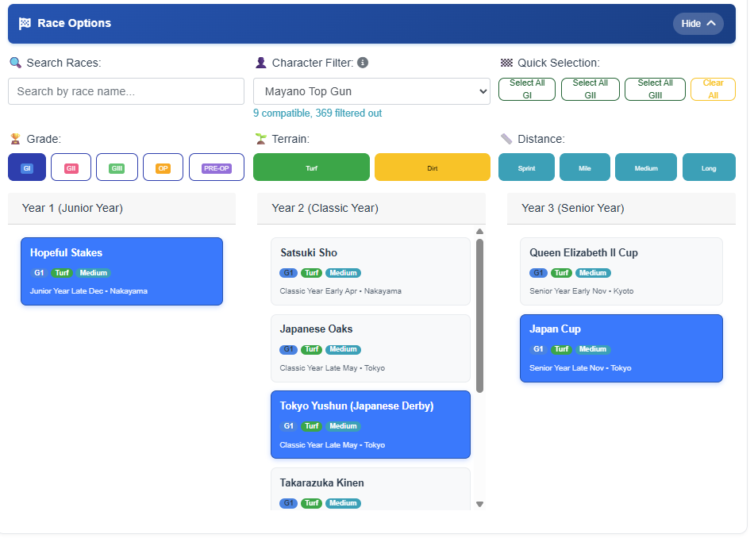
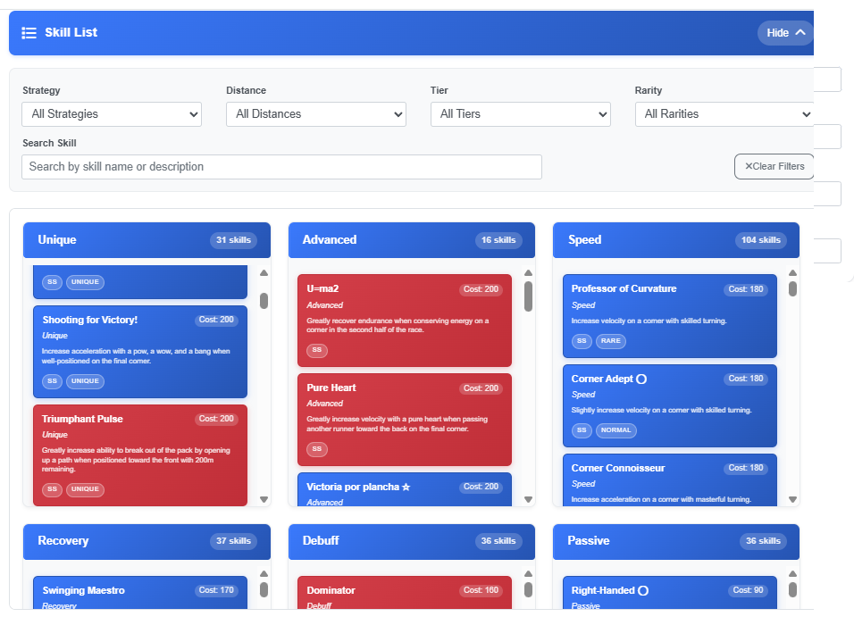
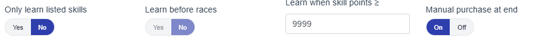

memory leak lmao hold on leme find it

# New user? [Read this to improve your runs](#training-settings-guide)

## **Credits**
- **Original Orginal Repository**: [UmamusumeAutoTrainer](https://github.com/shiokaze/UmamusumeAutoTrainer)

- **This project is a detached fork of**: [UmamusumeAutoTrainer](https://github.com/BrayAlter/UAT-Global-Server) 

---

## **Features**

### **Core Automation**
- ✅ **Automatic Training**: Complete training scenarios for ALL Umas
  - This includes the handling of:  
    - **Custom races** 
    - **Skill acquisition**
    - **Claw machine**
    - **Running styles** 
    - **Alarm clock usage** 
    - **Building fiendship early, focus on rainbows later** 
    - **Optimal event choices (Knows when to build friendship/recover energy and mood)**
    - **Skipping bad turns with wit training**
    - **I'm not gonna list everything. Just search for keywords in the repo if you are wondering if a feature exist**

- ✅ **Completely hands off**: Recover tp, Starting runs, finding the right guest card
  - **Everything is 100% automated you can just afk for **DAYS** until legacy umas are full**
  - **Handles everything from disconnections to the game crashing. The show will go on as long as there isn't a new update. (it handles that too now lol)**
  - **Supports background play via emulators. (You can play another game while this runs)**
  - **If Auto tp recovery is set to false it will wait until you have enough tp to start the career run**

- ✅ **Saving of presets**: Save training parameters for easy access in future runs 

### **Demo Run**
- I'd say its about 80% as competent as a actual player. This makes the bot not just a fan/parent farmer but it's more than capable of producing ACES  
[Demo run with a older build (im too lazy to record a new one)](https://youtu.be/J07n4wvLSCw)

## 🚨 **Safety**
- Question: Is this safe?  
- Answer: Safer than the steam release (All of your processes are transparent lmao), I have done what I can to humanize the inputs. **BUT** if they decide to put in the effort they **WILL** find you. It is near impossible to simulate perfect human behavior with code so use at your own risk. I take no responsibility.  **HIDING BEHIND A EMULATOR DOES NOT MAKE YOU UNDETECTABLE YOU HAVE BEEN WARNED**

- Answer 2: As long as there are people cheating on the steam release we are chilling (if ykyk)  
  - https://en.wikipedia.org/wiki/Sentinel_species
  
Running this 24/7 looks sus as hell so I would suggest turning it off for a few hours every day.  
(I’m just gonna risk it and run it 24/7 I’ll let you guys know if I get banned)

## 📦 **Installation & Setup**

#### **Clone Repository**
```bash
git clone https://github.com/oofmatoes/UAT-Global-Server
cd UAT-Global-Server
````

### **Emulator Setup**

* **Only tested on bluestacks pie64**
* **Resolution**: 720 × 1280 (Portrait mode)
* **DPI**: 180
* **Graphics**: Standard (not Simple)
* **ADB**: Must be enabled in emulator settings

### **Launch**

Ensure python 3.10 is installed:

```bash
uninstall whatever python version you have

winget install -e --id Python.Python.3.10

pip install -r requirements.txt
```

After that you can just:

```bash
python main.py
```

---

## ⚠️ **Important Notes**

### **Game Settings**

1. **Graphics**: Must be set to "Standard", not "Basic"
2. **Training Setup**: **Manually select** Uma Musume, Legacy, and Support Cards in-game before starting
3. **Support Cards**: Avoid friend cards (no specific outing strategy)

## 🔧 **Troubleshooting**

### **Common Issues**

#### **Fan Goals Fail**

* **Failed to the next goal races because lack of Fans**: Configure the race selection first in the UAT website to avoid lack of Fans

#### **ADB Device Detection**

* **No devices found**: Ensure emulator is running and ADB is enabled and open the umamusume app
* **ADB server issues**: The app automatically restarts ADB server if needed
* **Device not detected**: Check emulator's ADB settings

#### **PowerShell Script Issues**

* **Script crashes**: Open console first to see error messages
* **Execution policy**: Reference: [PowerShell Execution Policy](https://www.jianshu.com/p/4eaad2163567)

#### **Connection Problems**

* **ADB connection fails**: Close accelerators, kill adb.exe, restart emulator

## ⚠️ **Known issues / Won’t fix**

* Bot seems to get stuck sometimes

  * There are failsafes in place. It should break out of it within 5 minutes. If not then yeah I'll fix it.
* Detection of supports sometimes fails (you will know this if it keeps clicking wit training/a bad training and in the logs the score is either stuck/only detecting unknown cards)

  * Just restart both bluestacks and the bot.
  * If it works from the start then it should not break halfway (it either breaks 100% of the time since launch or it’s fine and will never break) so it’s not really an issue. I also have no idea what’s causing this.
* Sometimes it fails to detect the hint (!)

  * It’s animated, so either I kill performance and template match like 20 screenshots or we just take the L when it fails to detect like 5% of the time
  * Could also check the general area for red pixels but it led to a bunch of false positives from my testing

## **Training settings guide**
- **Upon creating a new deck the first thing you should do is experiment with the values under advanced options**
- These values are made for 3/3 split decks THEY ARE NOT 1 SIZE FITS ALL  
  

- ### **STAT CAPS**
- Under normal circumstances you want to just put a large number into all of them like so this way it will always pick the best training option
  
- HOWEVER if you keep maxxing out a stat too early for example 1000+ speed before the 2nd summer you would want to do this
  
- Stat caps work like this
 - Soft cap  
  When at least 80% of the desired stat that training gets a 20% score nerf during training selection
 - Hard cap  
  After exceeding the stat cap the training will now recieve a 40% score nerf during training selection
 - HOWEVER IT IS ENCOURAGE THAT YOU RE-EVALUATE YOUR DECK INSTEAD. THIS WAY THE BOT CAN CLICK THE BEST OPTION 100% OF THE TIME INSTEAD OF ARTIFICIALLY LIMITING

- ### **STRUGGLING WITH A CERTAIN STAT**
- If you are struggling with a certain stat (Guts) you can raise the summer weight of that stat (while reducing others) to encourage the bot totake advantage of the LV5 summer facilities
  

- ### **Hint/Skills hunting**
- Raise the score of hints. This way the bot will always take the training with hints in them
  
- If you want to bot to select a certain event option to get a skill ur going to have to diy it for now
  > Head over to UAT-Global-Server\resource\umamusume\data\event_data.json  
  > Ctrl F find your event  
  > Increase one of the stat gain to a very big number  
  > Then that choice should get picked all the time   
    
  > Save a backup so it doesn't get overwritten when the repo gets updated

- ### **STRUGGLING WITH THE CAREER**
- ### Early game stat gain is too low
- Raise the classic year rainbows score to promote early game stat growth (this will hurt long term stat gain however)
  

- ### The bot picks bad races when not enough fans to meet goals (Pre-op, Op, G3)
- If a career runs has high fan goals (Top gun, Urara) you should be manually selecting the races instead of letting the bot pick for you
  

- ### The bot is buying irelevant skills.
- Left click on a skill to prioritize it (blue), right click to blacklist it (red)   
  
- OR set Learn when skill points ≥ to a very high number and set manual purchase to true
  

## 🤝 **Contributing**

If you ask and pinky promise you won't just nuke everything I can just give you collaborator permissions.

## **Disclosure**
Something Something this is for educational purposes only. Please do not misuse to break umamusume or cygames terms of service.   
*cough cough*

